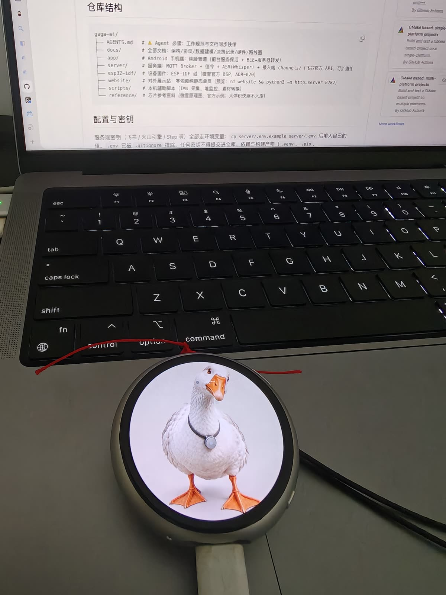
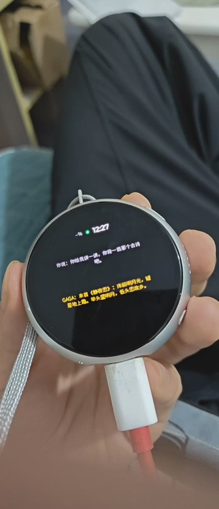
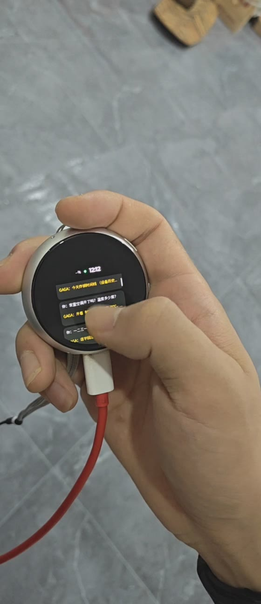
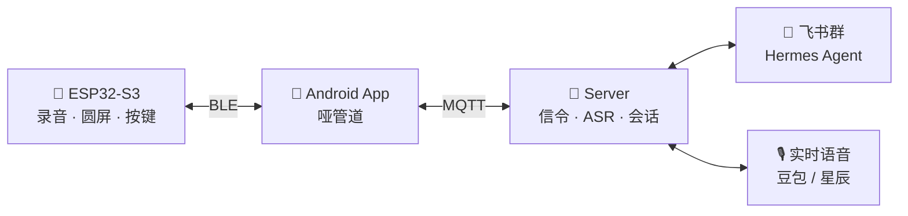

<div align="center">


# GaGa AI

**Grasp up, Get AI.** —— 挂在胸前的单手 AI 入口

按住说话，AI 帮你记、帮你查、帮你办。**另一只手，不用离开正在做的事。**

[真机演示](#-真机演示) · [架构](#-架构) · [快速开始](#-快速开始) · [文档](#-文档导航)

    

</div>

---



<p align="center"><sub>实机：微雪 ESP32-S3 · 1.75″ AMOLED 圆屏 · 挂绳佩戴 · 两颗键。圆屏上是吉祥物——一只戴 gaga 挂件的白鹅 🦢</sub></p>

## 🎬 真机演示

<table>
  <tr>
    <th width="50%"><a href="docs/assets/demo/demo-conversation.mp4">▶ 对话：按住说话 → 回复逐字上屏</a></th>
    <th width="50%"><a href="docs/assets/demo/demo-message-ui.mp4">▶ 消息卡：录音 → 列表 → 点开详情</a></th>
  </tr>
  <tr>
    <td><a href="docs/assets/demo/demo-conversation.mp4"></a></td>
    <td><a href="docs/assets/demo/demo-message-ui.mp4"></a></td>
  </tr>
  <tr>
    <td><sub>挂绳佩戴，真实使用形态：说一句，AI 的回答实时打到圆屏上</sub></td>
    <td><sub>一问一答一张卡，离屏随时回看；录音中有红点与计时</sub></td>
  </tr>
</table>

> 点击封面跳转 GitHub 视频播放页（含环境音）。

## 🤔 为什么做这个

骑摩托车想记一笔灵感、做饭时想查个事、抱着孩子想发条消息——**手被占着**，
"掏手机 → 解锁 → 找 App → 打字"这条链路太长了。

gaga 挂在胸前：**按住右下键说话，松手就发**。转写交给云端 ASR，执行交给
飞书群里的 Hermes Agent，回答回到飞书群的同时打到胸前的圆屏上。全程单手、
不用看手机。

## ✨ 特性

- 🎙️ **按住说话 → AI 执行**：千问 ASR 流式转写（润色定稿、错字自动纠正）
- 🗣️ **实时语音对话**：长按右上键直接聊，全双工；豆包 / 星辰双引擎，**设备上一键切换**
- 🤖 **背后是 Agent**：飞书群里的 Hermes 带工具调用——查天气、控家电、记日记、定时提醒
- 📟 **消息卡 UI**：一问一答一张卡，未读高亮，圆屏上随时回看
- 🤳 **单手手势**：摇一摇亮屏、翻转静音，全部为"手被占用"设计
- 🔌 **哑管道架构**：手机 App 只转发不解析，大脑全在服务端——换手机、换 IM、换模型都不动设备

## 🏗️ 架构



三条铁律：

- **音频帧 = 二进制，信令 = JSON 文本帧**，一个字节都不含糊
- **App 永远哑管道**：只转发不解析，业务逻辑零容忍
- **服务端是唯一大脑**：鉴权、ASR、工具分发、日志全在 server/

在家 WiFi 直连；户外 App 代挂 BLE+MQTT，断链即时提示（按键前先预检）。

## 🚀 快速开始

三个组件，各自目录里有完整 README：

```bash
# 服务端（macOS/Linux）：MQTT 桥 + ASR + 飞书接入
cd server && cp .env.example .env   # 填飞书/火山/百炼密钥
uv venv --python 3.12 && uv pip install -e . && .venv/bin/gaga-server

# Android 哑管道 App
cd app && ./gradlew assembleDebug   # 需 JDK 25 + Gradle 9.x

# 设备固件（PlatformIO + ESP-IDF，微雪官方 BSP）
cd esp32-idf && pio run -t upload
```

密钥全部走环境变量，`.env` 不入库。

## 🎛️ 单手交互

| 按键 | 动作 | 功能 |
|---|---|---|
| 右上 | 单击 | 亮屏（10s 自动息屏） |
| 右上 | 长按 | 实时语音对话（再按结束） |
| 右下 | 长按 | 按住说话：滴滴 → 说 → 松手 → 发送 |
| 整机 | 摇一摇 | 亮屏 |

设备侧的引擎切换（豆包/星辰）在设置页完成，选择权在小设备。

## 📚 文档导航

| 文档 | 内容 |
|---|---|
| [docs/architecture.md](docs/architecture.md) | 系统架构与三组件职责 |
| [docs/protocol.md](docs/protocol.md) | BLE 帧格式 / 信令 / MQTT 主题 |
| [docs/data-model.md](docs/data-model.md) | 信令 schema 与数据实体 |
| [docs/decisions.md](docs/decisions.md) | 架构决策记录（ADR，只追加不改史） |
| [docs/hardware.md](docs/hardware.md) | 硬件规格、引脚、实测功耗 |
| [docs/roadmap.md](docs/roadmap.md) | 里程碑与进度 |
| [docs/dev-log.md](docs/dev-log.md) | 开发日记（按天） |

## 🔩 硬件

微雪 **ESP32-S3-Touch-AMOLED-1.75**：466×466 圆屏 · 32MB Flash · 双麦克风 + AEC ·
QMI8658 六轴 IMU · XP2101 PMU · 双实体按键。原理图与开发板资料见 `reference/`。
